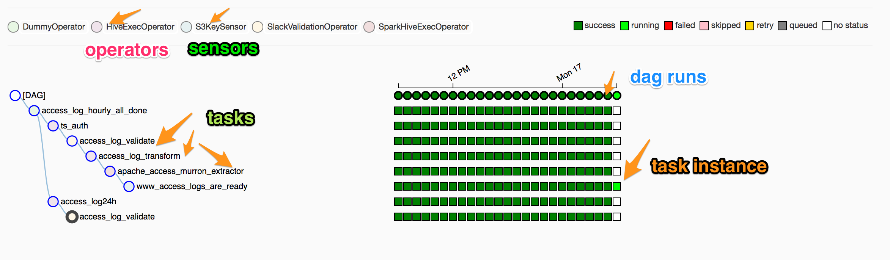

# Airflow concepts

### DAG:

In Airflow, a DAG – or a Directed Acyclic Graph – is a collection of all the tasks you want to run, organized in a way that reflects their relationships and dependencies.

For example, a simple DAG could consist of three tasks: A, B, and C. It could say that A has to run successfully before  B can run, but C can run anytime. It could say that task A times out after 5 minutes, and B can be restarted up to 5 times in case it fails. It might also say that the workflow runs every night at 10 pm, but shouldn’t start until a specific date. In this way, a DAG describes how you want to carry out your workflow.

### Operators:

The atomic units of DAGs - while DAGs describe how to run a workflow, Operators determine what actually gets done. Operators describe single tasks in a workflow and can usually stand on their own.

*Some pre-build operators are:*

- BashOperators
- EmailOperators
- PythonOperators

### Sensors:

Sensors are the special operators, which can pause the execution of dependent tasks until some criterion has met. In principle, Operators can perform any function that can be executed. Similarly, Sensors can check the state of any process or data structure.

### Tasks:

Once an operator is instantiated, it is referred to as a `task`. The instantiation defines specific values when calling the abstract operator, and the parameterized task becomes a node in a DAG.

### Task Instances

A task instance represents a specific run of a task and is characterized as the combination of a dag, a task, and a point in time. Task instances also have an indicative state, which could be `running`, `success`, `failed`, `skipped`, `up for retry`, etc.

### DAG Runs:

A DAG Run is an object representing an instantiation of the DAG in time. DAG runs have a state associated to them (`running`, `failed`, `success`) and informs the scheduler on which set of schedules should be evaluated for task submissions. Without the metadata at the DAG run level, the Airflow scheduler would have much more work to do in order to figure out what tasks should be triggered and come to a crawl.

*Preset Crons:*

| preset     | meaning                                                         | cron        |
| ---------- | --------------------------------------------------------------- | ----------- |
| `None`     | Don't schedule, use for exclusively "externally triggered" DAGs |             |
| `@once`    | Schedule once and only once                                     |             |
| `@hourly`  | Run once an hour at the beginning of the hour                   | `0 * * * *` |
| `@daily`   | Run once a day at midnight                                      | `0 0 * * *` |
| `@weekly`  | Run once a week at midnight on Sunday morning                   | `0 0 * * 0` |
| `@monthly` | Run once a month at midnight of the first day of the month      | `0 0 1 * *` |
| `@yearly`  | Run once a year at midnight of January 1                        | `0 0 1 1 *` |

