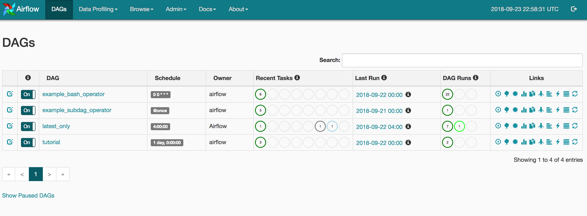
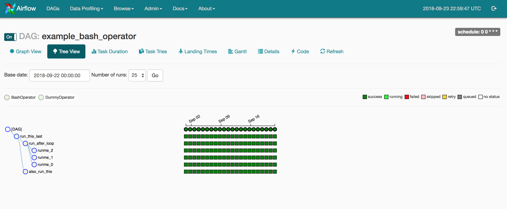
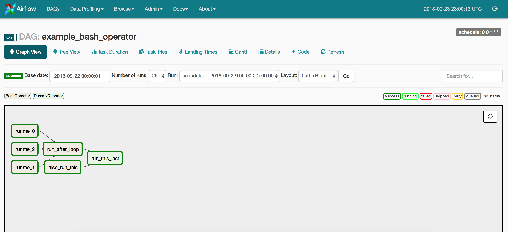
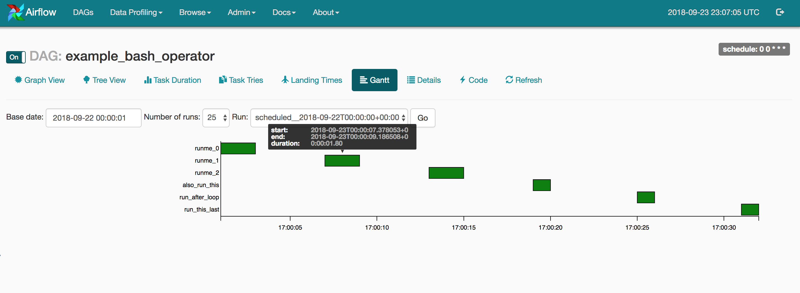
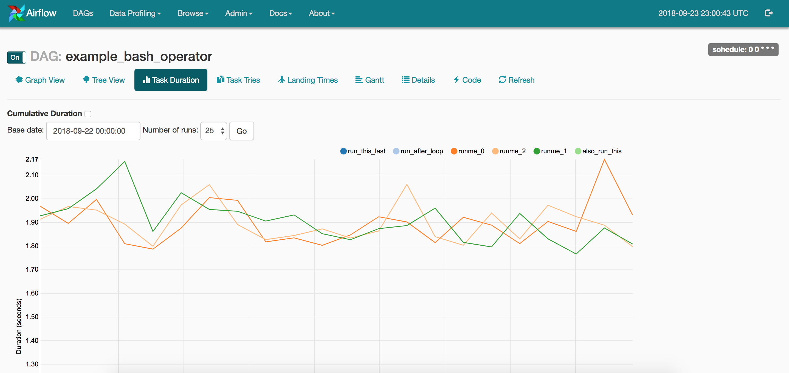
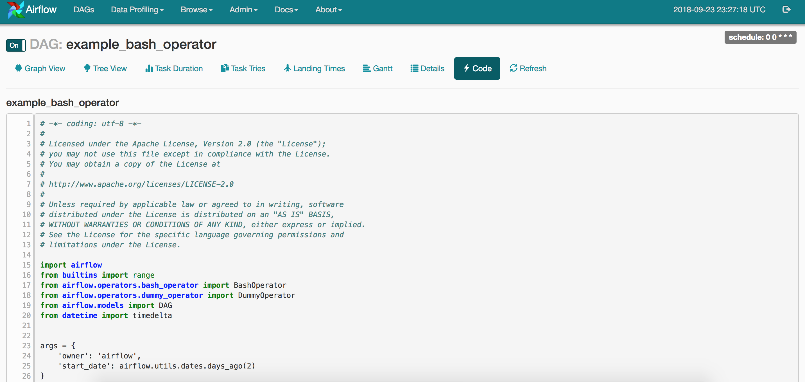
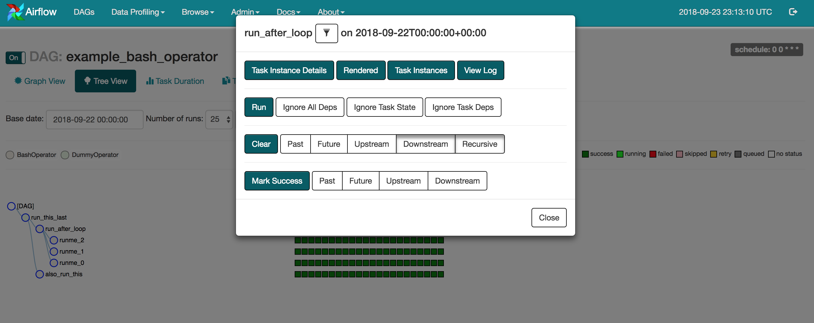

# Airflow UI

The Airflow UI makes it easy to monitor and troubleshoot your data pipelines.

### DAG View:

List of the DAGs in your environment, and a set of shortcuts to useful pages. You can see exactly how many tasks succeeded, failed, or are currently running at a glance.

### Tree View:

A tree representation of the DAG that spans across time. If a pipeline is late, you can quickly see where the different steps are and identify the blocking ones.

### Graph View:

The graph view is perhaps the most comprehensive. Visualize your DAG's dependencies and their current status for a specific run.

### Gantt Chart:

The Gantt chart lets you analyse task duration and overlap. You can quickly identify bottlenecks and where the bulk of the time is spent for specific DAG runs.

### Task Duration:

The duration of your different tasks over the past N runs. This view lets you find outliers and quickly understand where the time is spent in your DAG over many runs.

### Landing Time:

The total time spent by a task from the scheduling period including retries. (e.g.) take a `schedule_interval='@daily'` run that finishes at `2016-01-02 03:52:00` landing time is `3:52` (The task scheduled to start at 2016-01-02 00:00:00)

### Code View:

### Task Instance Context Menu:

From the pages seen above (tree view, graph view, gantt, ...), it is always possible to click on a task instance, and get to this rich context menu that can take you to more detailed metadata, and perform some actions.

### Variable View:

The variable view allows you to list, create, edit or delete the key-value pair of a variable used during jobs. Value of a variable will be hidden if the key contains any words in ('password', 'secret', 'passwd', 'authorization', 'api\_key', 'apikey', 'access\_token') by default, but can be configured to show in clear-text.

### Browse View:

Browse view help to build a more drill-down analysis and do bulk operations of Airflow core entities such as `DAG Runs`, `Task Instances`, `Logs`, `Jobs` & `SLA misses`.

### Admin View:

The Admin View help to configure airflow pool, connections, variables, and users.

### Airflow Cli Tools:

Airflow has a very rich command line interface that allows for many types of operation on a DAG, starting services, and supporting development and testing.

