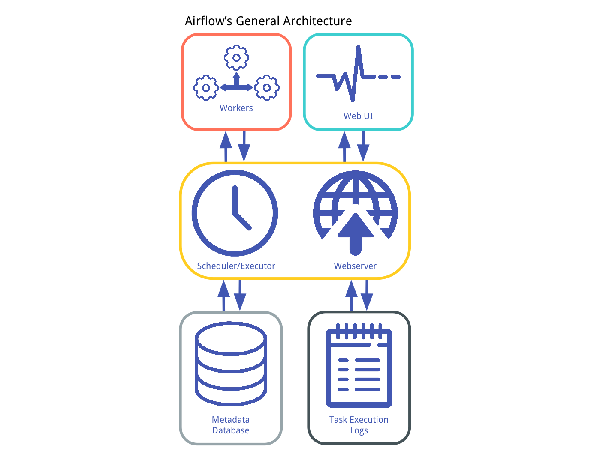

# Airflow Scheduler

### Airflow Architecture:

At its core, Airflow is simply a queuing system built on top of a metadata database. The database stores the state of queued tasks and a scheduler uses these states to prioritize how other tasks are added to the queue. This functionality is orchestrated by four primary components:

### Metadata Database:

This database stores information regarding the state of tasks. Database updates are performed using an abstraction layer implemented in SQLAlchemy. This abstraction layer cleanly separates the function of the remaining components of Airflow from the database.

### Scheduler:

The Scheduler is a process that uses DAG definitions in conjunction with the state of tasks in the metadata database to decide which tasks need to be executed, as well as their execution priority. The Scheduler is generally run as a service.

### Executor:

 The Executor is a message queuing process that is tightly bound to the Scheduler and determines the worker processes that actually execute each scheduled task. There are different types of Executors, each of which uses a specific class of worker processes to execute tasks. For example, the `LocalExecutor` executes tasks with parallel processes that run on the same machine as the Scheduler process. Other Executors, like the `CeleryExecutor` execute tasks using worker processes that exist on a separate cluster of worker machines.

### Workers:

These are the processes that actually execute the logic of tasks, and are determined by the Executor being used.

## How Airflow Scheduler works?

#### Step 0.

Look into Airflow base dag path and parse the python files. Load the available DAG definitions from disk (fill DagBag)

`***While the scheduler is running:**`

#### Step 1.

The scheduler uses the DAG definitions to identify and/or initialize any DagRuns in the metadata db.

#### Step 2.

The scheduler checks the states of the TaskInstances associated with active DagRuns, resolves any dependencies amongst TaskInstances, identifies TaskInstances that need to be executed, and adds them to a worker queue, updating the status of newly-queued TaskInstances to "queued" in the datbase.

#### Step 3.

Each available worker pulls a TaskInstance from the queue and starts executing it, updating the database record for the TaskInstance from `queued.` to `running.`

#### Step 4.

Once a TaskInstance is finished running, the associated worker reports back to the queue and updates the status for the TaskInstance in the database (e.g. "finished", "failed",etc.)

#### Step 5.

The scheduler updates the states of all active DagRuns ("running", "failed", "finished") according to the states of all completed associated TaskInstances.

#### Step 6:

`***Repeat Steps 1-5`***

### Job Scheduling:

The scheduler runs the job at the END each period,starting one `schedule_interval` AFTER the start date. So for a `0 19 * * *` schedule (`daily at 19:00 UTC`), The tasks for the `start date 2018-10-27` will start **justafter** `2018-10-28 18:59:59.999`

### Notes:

- The first DAG Run is created based on the minimum `start_date` for the tasks in your DAG.
- The scheduler process creates subsequent `DAG Runs`, based on your DAG’s `schedule_interval`, sequentially.
- If you change the `start_date` of a DAG, you must change the `dag_name` as well.

*credit: * https://medium.com/@dustinstansbury/understanding-apache-airflows-key-concepts-a96efed52b1a
