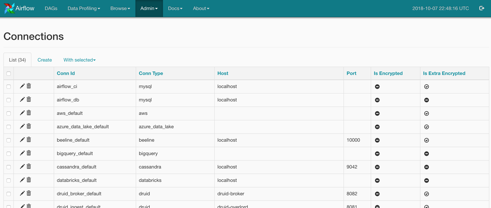
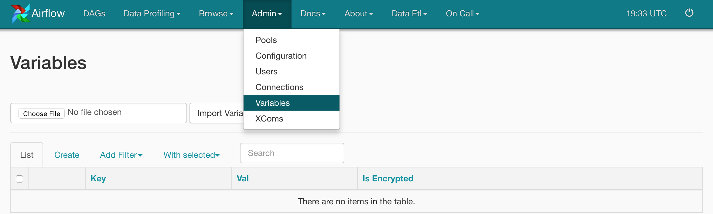

# Advance Airflow Concepts

### Airflow Hooks:

Hooks meant as an interface to interact with external systems. Hooks handle the connection and interaction to specific instances of these systems, and expose consistent methods to interact with them.

Some of the inbuild hooks are,

- HiveHook
- mysql
- mssql
- oracle
- http
- Slack

#### Custom Hook:

extend `BaseHook` class and override `get_conn`, `get_records`, `run` methods as needed

### Connections:

Connections store information about different external data sources instances connection information. The idea here is that scripts use references to database instances (conn_id) instead of hard-coding hostname, logins and passwords when using operators or hooks.

#### Airflow connections via Airflow UI

##### List all the connections:



##### Create a new connection:


#### Airflow connections via environment variable (Recommended):

Airflow will consider any environment variable with the prefix `AIRFLOW_CONN`. (e.g) to set `S3_DEFAULT` connection, you can set the environment variable `AIRFLOW_CONN_S3_DEFAULT`

### Variables:

Variables are a generic way to store and retrieve arbitrary content or settings as a simple key-value store within Airflow.It is useful to set environment variable to pass across the pipeline.



Apart from UI, we can set environment variable programmatically as well, 

```python
from airflow.models import Variable
Variable.set("foo","value")
foo = Variable.get("foo")
Variable.set("bar",'{ "name":"John", "age":30, "city":"New York"}') # set json as a value
bar = Variable.get("bar", deserialize_json=True) # deserialize json value
```

### Macros & Templates:

Airflow leverages the power of Jinja Templating, and this can be a powerful tool to use in combination with macros. Macros are a way to expose objects to your templates and live under the macros namespace in your templates.

Airflow build-in macros: 

https://airflow.apache.org/code.html#macros

Airflow build-in templates variables: 

https://airflow.apache.org/code.html#default-variables

##### Custom airflow macros:

Step 1: define the custom macro

```python
CUSTOM_MACROS = {
  'echo': lambda id: 'echo ' + id
}
```

Step 2: configure the macro in the airflow dag definition

```python
dag = DAG(
    dag_id='example_bash_operator', default_args=args,
    schedule_interval='0 0 * * *',
    dagrun_timeout=timedelta(minutes=60),
    user_defined_macros=CUSTOM_MACROS # user defined macros added to the dag context
)
```

Step 3: Access using jinja template variables

```python
CMD ='{{echo("joe")}}'
task = BashOperator(
        task_id='runme',
        bash_command=CMD,
        dag=dag)
```

### XCom:

XComs, or short for "cross-communication" are stores of key, value, and timestamps meant to communicate between tasks. XComs stored in Airflow's metadata database with an associated `execution_date`, `TaskInstance`, and `DagRun`.

XComs can be “pushed” (sent) or “pulled” (received). When a task pushes an XCom, it makes it generally available to other tasks. Tasks can push XComs at any time by calling the`xcom_push()`method.

```python
from __future__ import print_function
import airflow
from airflow import DAG
from airflow.operators.python_operator import PythonOperator

args = {
    'owner': 'airflow',
    'start_date': airflow.utils.dates.days_ago(2),
    'provide_context': True
}

dag = DAG(
    'example_xcom',
    schedule_interval="@once",
    default_args=args)

value_1 = [1, 2, 3]
value_2 = {'a': 'b'}


def push(**kwargs):
    # pushes an XCom without a specific target
    kwargs['ti'].xcom_push(key='value from pusher 1', value=value_1)


def push_by_returning(**kwargs):
    # pushes an XCom without a specific target, just by returning it
    return value_2


def puller(**kwargs):
    ti = kwargs['ti']

    # get value_1
    v1 = ti.xcom_pull(key=None, task_ids='push')
    assert v1 == value_1

    # get value_2
    v2 = ti.xcom_pull(task_ids='push_by_returning')
    assert v2 == value_2

    # get both value_1 and value_2
    v1, v2 = ti.xcom_pull(key=None, task_ids=['push', 'push_by_returning'])
    assert (v1, v2) == (value_1, value_2)


push1 = PythonOperator(
    task_id='push', dag=dag, python_callable=push)

push2 = PythonOperator(
    task_id='push_by_returning', dag=dag, python_callable=push_by_returning)

pull = PythonOperator(
    task_id='puller', dag=dag, python_callable=puller)

pull.set_upstream([push1, push2])
```

It is also possible to pull XCom directly in a template.

```python
{{ task_instance.xcom_pull(task_ids='push', key='value from pusher 1') }}
```

Further studies:

https://www.astronomer.io/guides/airflow-datastores/
